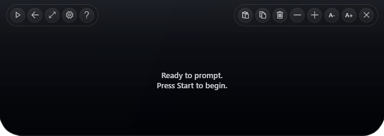

# PromptBar

<p align="center">
  
</p>

A lightweight floating teleprompter bar for Windows.

PromptBar sits at the top of your screen as a compact, always-on-top script reader. It is built for presentations, screen recordings, interviews, lessons, and any workflow where you want a script visible without switching windows.

## Download

Download the latest `PromptBarPortable.exe` from GitHub Releases.

The app is portable: no installer and no companion files are required.

Release builds:

- `PromptBarPortable.exe` chooses the Windows 10/11 visual mode automatically.
- `PromptBar-Windows11.exe` forces the Windows 11 Fluent-style mode.
- `PromptBar-Windows10.exe` forces the Windows 10 fallback mode.

## Features

- Compact top-center teleprompter overlay.
- Windows Fluent-inspired dark interface.
- Inline text editing directly inside the overlay.
- Settings window with language, font, size, speed, display, privacy, and hotkey controls.
- Resize mode from the overlay controls.
- Start/pause, reset, and jump back 5 seconds.
- Adjustable speed, font size, overlay width, and overlay height.
- Font picker with Apple / SF Pro style fallback by default.
- Multi-language UI: English, Russian, Uzbek, Spanish, Italian, French, Portuguese, Karakalpak, Tajik, Kazakh, Belarusian, Japanese, Chinese, and Hindi.
- TXT, MD, RTF, and DOCX script import/export.
- Copy/paste buttons plus `Ctrl+A`, `Ctrl+C`, and `Ctrl+V` in text editors.
- Editable global hotkeys.
- Best-effort privacy mode via Windows display affinity.
- Single-file portable build.

## Default Hotkeys

| Shortcut | Action |
| --- | --- |
| `Ctrl+Alt+P` | Start / pause |
| `Ctrl+Alt+R` | Reset scroll |
| `Ctrl+Alt+J` | Jump back 5 seconds |
| `Ctrl+Alt+H` | Toggle privacy mode |
| `Ctrl+Alt+O` | Toggle overlay visibility |
| `Ctrl+Alt+=` | Increase speed |
| `Ctrl+Alt+-` | Decrease speed |
| `Ctrl+Alt+]` | Increase font size |
| `Ctrl+Alt+[` | Decrease font size |

## Build From Source

PromptBar intentionally uses plain .NET Framework/WPF source files and the built-in Windows C# compiler. No NuGet packages or .NET SDK are required on a typical Windows developer machine.

```powershell
powershell -ExecutionPolicy Bypass -File .\build.ps1
```

Build outputs:

```text
bin\PromptBar.exe
dist\PromptBarPortable.exe
dist\PromptBar-Windows11.exe
dist\PromptBar-Windows10.exe
```

`dist\PromptBarPortable.exe` is the default file intended for sharing. Use the Windows-specific files when you want to force a visual mode.

## Requirements

- Windows 10 or Windows 11.
- .NET Framework 4.x enabled.

## Privacy Note

Privacy mode is best-effort. PromptBar asks Windows to exclude the overlay from screen capture, but actual behavior can vary by Windows version, GPU driver, and the recording or screen-sharing app.

## Project Status

PromptBar is an early Windows-native port and redesign. It is usable, portable, and actively evolving.

## License

MIT. See [LICENSE](LICENSE).

## Credits

PromptBar started as a Windows port inspired by the original macOS Notchprompt project. See [NOTICE](NOTICE.md).
